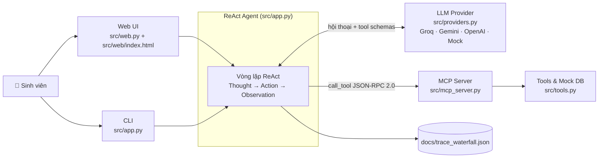

# 📚 Trợ lý Thư viện Đại học — ReAct Agent + MCP Server

> **Bài Lab 3 (`DAY03-REACT-AGENT`) — Chatbot vs ReAct Agent (MCP Enhanced)** · Lớp K4B  
> **Học viên:** Nguyễn Thị Hải Mi · **MSSV:** 2A202602667  
> **Chủ đề:** Trợ lý Quản lý Thư viện & Tài liệu — Tra cứu vị trí sách, tình trạng mượn/trả và gia hạn tài liệu.

ReAct Agent cho phép sinh viên tra cứu và xử lý các việc thường ngày với thư viện **trực tuyến, mọi lúc**, và quan trọng nhất là **biết trước thông tin / điều kiện để không phải ra tận thư viện rồi mới biết kết quả**. Agent suy luận theo vòng lặp `Thought → Action → Observation`, gọi công cụ qua **MCP Server** (JSON-RPC 2.0) và ghi lại toàn bộ chuỗi suy luận vào Waterfall Trace Log.

---

## 1. Bài toán

### Bối cảnh
Thư viện của một trường đại học có hàng nghìn đầu sách, mỗi đầu có nhiều bản, xếp ở nhiều khu / tầng / kệ khác nhau. Người dùng chính là sinh viên / độc giả của trường. Toàn bộ hoạt động hiện vận hành **thủ công, chỉ offline tại chỗ**:

- Danh mục sách và tình trạng còn/mượn được theo dõi bằng sổ hoặc file nội bộ, chỉ thủ thư tại quầy truy cập được.
- Vị trí sách (khu, tầng, kệ) nằm trong đầu thủ thư hoặc trong sổ, sinh viên không tự tra được.
- Hồ sơ mượn/trả (đang mượn gì, hạn khi nào, đã gia hạn mấy lần, có phạt không) do quầy quản lý; hạn trả ghi bằng con dấu trong sách hoặc trên phiếu mượn.
- Mọi thao tác — tìm sách, kiểm tra mình đang mượn gì, gia hạn — đều bắt buộc phải đến tận thư viện, trong giờ mở cửa, và thường phải qua quầy thủ thư.

### Painpoint
**Painpoint gốc:** mọi việc đều buộc phải ra tận thư viện mới làm được → tốn thời gian di chuyển, bị bó vào giờ mở cửa, phải xếp hàng chờ thủ thư, và nặng nhất là **đi công cốc** vì trước khi đi hoàn toàn mù thông tin.

| Hành vi | Painpoint cụ thể |
| :--- | :--- |
| **1. Tra cứu vị trí sách** | Không biết thư viện có cuốn đó không · không biết còn bản rảnh hay đã bị mượn hết · không biết sách nằm ở kệ nào. |
| **2. Check tình trạng mượn/trả** | Không tự tra được đang mượn gì, cuốn nào sắp tới hạn · không có nhắc hạn → phạt oan · chỉ để kiểm tra "còn nợ sách nào không" cũng phải đi một chuyến. |
| **3. Gia hạn tài liệu** | Bắt buộc ra quầy dù chỉ là dời ngày trả · không biết trước có đủ điều kiện gia hạn không → ra tới nơi mới bị từ chối · bị bó giờ mở cửa khi cần gia hạn gấp. |

### Giải pháp
Agent làm 3 việc cốt lõi:
1. **Tra dữ liệu thời gian thực** (catalog + hồ sơ mượn của chính user) → xóa cảnh "mù thông tin".
2. **Kiểm tra điều kiện tự động** (nhất là gia hạn) → biết trước được / không được.
3. **Thực hiện hành động thật** (gia hạn, đặt giữ) ngay trong hội thoại → không phải ra quầy, không bó giờ.

| Hành vi | Agent xử lý |
| :--- | :--- |
| **1. Tra cứu vị trí sách** | Tra catalog theo tên sách / tác giả / chủ đề → **còn bản rảnh:** báo vị trí kệ · **hết bản:** đề xuất đặt giữ, cho biết dự kiến khi nào có · **không có:** báo không có, gợi ý sách tương đương. |
| **2. Check tình trạng mượn/trả** | Xác định user bằng MSSV → tra hồ sơ → trả về cái nhìn tổng thể (sách đang mượn, hạn trả, phạt) và **chủ động cảnh báo** cuốn sắp tới hạn / đã quá hạn, gợi ý gia hạn. |
| **3. Gia hạn tài liệu** | Tra hồ sơ + kiểm tra điều kiện cho **từng cuốn** (có người đặt giữ? đang quá hạn cuốn khác? hết lượt gia hạn?) → **đủ điều kiện:** gia hạn, báo hạn mới · **vướng điều kiện:** từ chối kèm lý do và hướng xử lý. |

---

## 2. Agentic Fit (tóm tắt)

| Tiêu chí | Điểm |
| :--- | :---: |
| Multi-step Reasoning | 4 / 5 |
| Tool Interaction | 5 / 5 |
| Dynamic Decision | 5 / 5 |
| Long Horizon Goal | 3 / 5 |
| **Tổng** | **17 / 20** |

→ Tổng > 12/20: bài toán rất phù hợp triển khai ReAct Agent. Giải trình chi tiết tại [`docs/trace_eval.md`](docs/trace_eval.md).

---

## 3. Kiến trúc hệ thống



**Luồng xử lý:**
0. Độc giả **đăng nhập bằng MSSV** (UI / `--interactive`). MSSV được kiểm tra với dữ liệu độc giả; phiên đăng nhập gắn với mọi lượt hỏi sau đó.
1. Câu hỏi của user được thêm vào lịch sử hội thoại và gửi cho LLM kèm System Prompt ([`src/prompts.py`](src/prompts.py), có thông tin độc giả đang đăng nhập) và danh sách Tool Schema.
2. LLM quyết định **trả lời trực tiếp** (kết thúc) hoặc **gọi một / nhiều Tool** (Action).
3. Agent gửi yêu cầu tới MCP Server → MCP Server gọi Tool tương ứng → trả kết quả chuẩn JSON-RPC 2.0 (Observation).
4. Observation được nạp lại vào hội thoại, LLM suy luận bước tiếp theo. Lặp lại tối đa `MAX_ITERATIONS = 8` vòng.
5. Mỗi bước được ghi vào trace log.

---

## 4. Công cụ (Tools) trên MCP Server

Khai báo theo chuẩn JSON Schema trong [`src/tools.py`](src/tools.py):

| Tool | Tham số | Chức năng |
| :--- | :--- | :--- |
| `search_book` | `keyword` *(bắt buộc)*, `topic` | Tra catalog theo mã sách (`B001`), tên sách, tác giả hoặc chủ đề (khớp theo từng từ, không phân biệt dấu): có sách không, số bản rảnh, vị trí khu/tầng/kệ, có được mượn về không; hết bản → ngày dự kiến có sách + số người chờ; không tìm thấy → sách tương đương cùng chủ đề. |
| `get_borrow_record` | `student_id` | Hồ sơ mượn/trả: sách đang mượn, hạn trả, trạng thái `ON_TIME` / `DUE_SOON` / `OVERDUE`, phí phạt tạm tính, `can_renew` + lý do, tổng phạt, trạng thái khóa, sách đang đặt giữ, cảnh báo. |
| `renew_book` | `student_id`, `book_id` | Gia hạn **một** cuốn (+7 ngày). Tự kiểm tra 3 điều kiện; từ chối với mã `RESERVED_BY_OTHERS` / `HAS_OVERDUE` / `MAX_RENEWALS_REACHED` / `NOT_BORROWED` kèm hướng xử lý. |
| `reserve_book` | `student_id`, `book_id` | Đặt giữ sách đã hết bản; trả về vị trí hàng chờ, ngày dự kiến có sách, thời gian giữ chỗ. |

**Kiểm soát truy cập:** độc giả chỉ được xem và thao tác trên hồ sơ của chính mình. Quy tắc được áp dụng **trong code của MCP Server** (không chỉ dựa vào prompt): các Tool có tham số `student_id` được gọi với MSSV khác MSSV đang đăng nhập sẽ bị từ chối với `PERMISSION_DENIED`; nếu LLM không truyền `student_id`, MCP Server tự điền MSSV đang đăng nhập. `search_book` không trả về danh tính người mượn / người đặt giữ.

---

## 5. Quy định nghiệp vụ

Theo văn bản quy định giả định **QĐ-TV-01** ([`QuyDinh_ThuVien.docx`](QuyDinh_ThuVien.docx)):

| Mục | Quy định |
| :--- | :--- |
| Định danh | MSSV (8 ký tự), đồng thời là mã thẻ thư viện. |
| Mượn | Tối đa **5 cuốn** cùng lúc, **14 ngày**/lần. Tài liệu tra cứu (từ điển, atlas) chỉ đọc tại chỗ. |
| Gia hạn | Tối đa **2 lần**/cuốn, mỗi lần **+7 ngày** (tính từ hạn trả hiện tại). Phải thỏa **đồng thời**: không ai đặt giữ cuốn đó · độc giả không đang quá hạn cuốn nào (kể cả chính cuốn đó) · chưa gia hạn đủ 2 lần. |
| Đặt giữ | Chỉ khi đầu sách đã hết bản; ưu tiên theo thứ tự đặt; giữ chỗ **3 ngày** để đến nhận. Không đặt giữ khi tài khoản bị khóa hoặc đang mượn chính cuốn đó. |
| Phạt | **2.000đ / cuốn / ngày**. Tạm khóa khi quá hạn từ 30 ngày hoặc nợ phí từ 100.000đ. |
| Cảnh báo | Khi độc giả tra cứu: sắp tới hạn (còn ≤ 3 ngày) → nhắc trả / gia hạn; đã quá hạn → số ngày trễ + phí tạm tính. |

Các con số được khai báo một lần dưới dạng hằng số trong `src/tools.py` và dùng chung cho System Prompt.

---

## 6. Dữ liệu mẫu

Dữ liệu mô phỏng nằm trong `src/tools.py` (9 đầu sách, 6 độc giả). Ngày "hôm nay" được **cố định là 15/09/2026** để kết quả kiểm thử ổn định.

| MSSV | Độc giả | Tình huống kiểm thử |
| :--- | :--- | :--- |
| `21010123` | Lê Minh Anh | Có cuốn sắp tới hạn, gia hạn được. |
| `21010245` | Trần Quốc Bảo | Có 1 cuốn bị người khác đặt giữ (không gia hạn được) và 1 cuốn gia hạn được. |
| `21010367` | Phạm Thu Trang | Có cuốn đã gia hạn đủ 2 lần. |
| `21010489` | Vũ Đức Huy | Đang quá hạn 1 cuốn (phạt 28.000đ) → bị chặn gia hạn. |

Gia hạn / đặt giữ thay đổi dữ liệu trong bộ nhớ; dữ liệu trở về trạng thái ban đầu mỗi lần khởi động lại chương trình.

---

## 7. Cài đặt

> 🐍 **Python 3.10 – 3.12** (dự án được phát triển với Python 3.12).

```bash
git clone https://github.com/haimi612003/K4B-Day03-NguyenThiHaiMi-2A202602667.git
cd K4B-Day03-NguyenThiHaiMi-2A202602667

python3 -m venv .venv
source .venv/bin/activate            # Windows: .venv\Scripts\Activate.ps1
pip install -r requirements.txt

cp .env.example .env                 # Windows: copy .env.example .env
```

Cấu hình LLM trong file `.env`:

| Biến | Giá trị |
| :--- | :--- |
| `LLM_PROVIDER` | `gemini` (đang dùng) · `openai` · `groq` · `mock` |
| `LLM_MODEL` | `gemini-3.6-flash` (Gemini) · ví dụ `gpt-4o-mini` (OpenAI) · `openai/gpt-oss-120b` (Groq) |
| `GEMINI_API_KEY` | API key Gemini — lấy tại https://aistudio.google.com/apikey |
| `OPENAI_API_KEY` / `GROQ_API_KEY` | Dùng khi đổi `LLM_PROVIDER` sang `openai` / `groq` |

- **Chưa có API key hợp lệ** → chương trình tự chạy **Mock Offline** (mô phỏng quyết định của LLM bằng từ khóa, câu trả lời có tiền tố `[Mock Agent Response]`).
- **Đã có API key nhưng gọi API lỗi** → chương trình **dừng và báo lỗi**, không tự chuyển sang Mock, để tránh sinh trace log giả.
- **Gói Gemini miễn phí** giới hạn khoảng 5 lượt gọi / phút và 20 lượt / ngày cho mỗi model: vượt giới hạn **theo phút** thì chương trình tự chờ theo thời gian Google yêu cầu rồi thử lại (thời gian chờ không tính vào `latency_ms`); hết quota **theo ngày** thì báo lỗi ngay kèm hướng xử lý.

---

## 8. Chạy chương trình

```bash
# Kiểm tra MCP Server độc lập (Tool Schema + call_tool JSON-RPC)
python src/mcp_server.py

# Chạy 5 test case nghiệm thu → ghi docs/trace_waterfall.json
python src/app.py --all

# Chat trực tiếp trên terminal (nhập MSSV để đăng nhập; Agent nhớ ngữ cảnh giữa các lượt)
python src/app.py --interactive

# Giao diện web — tự mở http://localhost:8000
python src/web.py

# Kiểm thử offline (tìm sách, kiểm soát truy cập, phân loại lỗi quota) — không tốn quota LLM
python -m unittest discover -s tests
```

**Giao diện web** ([`src/web.py`](src/web.py) + [`src/web/index.html`](src/web/index.html)):
- **Trang đầu:** nhập MSSV để đăng nhập (báo lỗi nếu MSSV sai định dạng hoặc không tồn tại); danh sách MSSV thử nghiệm kèm tình huống của từng độc giả mẫu.
- **Sau khi đăng nhập:** thanh trên cùng hiển thị ngày hệ thống và provider / model đang dùng; cột trái có tên / MSSV độc giả, số liệu hồ sơ (đang mượn, sắp tới hạn, quá hạn, phí phạt — cập nhật sau mỗi câu trả lời), câu hỏi mẫu, nút xóa hội thoại và đăng xuất; khung chat nhiều lượt, mỗi câu trả lời có phần "Chuỗi ReAct" mở rộng hiển thị từng bước (Thought · Action · Observation · độ trễ).
- Server chỉ lắng nghe trên `127.0.0.1`; giao diện **không ghi đè** `docs/trace_waterfall.json`.

---

## 9. Test cases

Định nghĩa trong [`config/test_cases.json`](config/test_cases.json). Mỗi test case chạy với phiên đăng nhập của độc giả trong trường `student_id`:

| ID | Loại | Đăng nhập | Câu hỏi | Kỳ vọng |
| :--- | :--- | :--- | :--- | :--- |
| TC01 | `direct_query` | 21010123 | Điều kiện để được gia hạn sách là gì? | Trả lời trực tiếp từ quy định, không gọi Tool. |
| TC02 | `single_tool_query` | 21010123 | Còn cuốn 'Nhập môn Học máy' không, nằm ở kệ nào? | `search_book` → còn 2/3 bản, Khu A, Tầng 2, Kệ A2-05. |
| TC03 | `borrow_status_check` | 21010489 | Mình đang mượn gì, có bị phạt không? | `get_borrow_record` → cảnh báo quá hạn 14 ngày, phạt 28.000đ. |
| TC04 | `multi_step_reasoning` | 21010245 | Gia hạn giúp mình tất cả sách đang mượn. | `get_borrow_record` → `renew_book` từng cuốn: 1 thành công, 1 bị từ chối (có người đặt giữ). |
| TC05 | `edge_case_handling` | 21010489 | Gia hạn cuốn 'Dế Mèn phiêu lưu ký'. | `renew_book` bị từ chối (`HAS_OVERDUE`), nêu lý do và hướng xử lý, không bịa kết quả. |

---

## 10. Waterfall Trace Log

`python src/app.py --all` (hoặc `--interactive`) ghi toàn bộ chuỗi suy luận vào [`docs/trace_waterfall.json`](docs/trace_waterfall.json). Mỗi sự kiện gồm:

| Trường | Ý nghĩa |
| :--- | :--- |
| `step` | Số thứ tự vòng lặp ReAct trong câu hỏi |
| `query` | Câu hỏi của user |
| `action_type` | `TOOL_EXECUTION` · `FINAL_ANSWER` · `MAX_ITERATIONS_REACHED` |
| `thought` | Suy luận của LLM ở bước đó |
| `tool_name`, `arguments` | Tool được gọi và tham số (Action) |
| `observation` | Kết quả MCP Server trả về |
| `output` | Câu trả lời cuối |
| `latency_ms` / `tool_latency_ms` | Thời gian LLM suy luận / thời gian thực thi Tool |

Kết quả nghiệm thu và trích xuất log được tổng hợp tại [`docs/trace_eval.md`](docs/trace_eval.md).

---

## 11. Cấu trúc thư mục

```text
📁 K4B-Day03-NguyenThiHaiMi-2A202602667/
├── 📄 README.md                  # Tài liệu dự án (file này)
├── 📄 QuyDinh_ThuVien.docx       # Quy định mượn – trả – gia hạn (QĐ-TV-01, giả định)
├── 📄 requirements.txt
├── 📄 .env.example               # Mẫu cấu hình LLM Provider / API key
├── 📁 tests/test_tools.py        # Kiểm thử offline (unittest)
├── 📁 config/
│   ├── 📄 test_cases.json        # 5 test case của đề tài Thư viện
│   └── 📄 test_cases.example.json
├── 📁 src/
│   ├── 📄 app.py                 # ReAct Agent loop + CLI (--all / --interactive) + trace log
│   ├── 📄 web.py                 # Web server (Starlette): API đăng nhập / chat gọi ReAct Agent
│   ├── 📁 web/index.html         # Giao diện web (HTML/CSS/JS)
│   ├── 📄 mcp_server.py          # MCP Server: list_tools / call_tool (JSON-RPC 2.0)
│   ├── 📄 tools.py               # Tool Schemas, quy định nghiệp vụ, dữ liệu mẫu, execution layer
│   ├── 📄 prompts.py             # System Prompts
│   ├── 📄 providers.py           # LLM adapters: Groq / Gemini / OpenAI / Mock Offline
│   └── 📁 ai_levels/             # Code tham khảo của bài lab (không dùng trong dự án)
└── 📁 docs/
    ├── 📄 trace_eval.md          # Báo cáo nghiệm thu (Agentic Fit + trace + tổng kết)
    ├── 📄 trace_waterfall.json   # Waterfall Trace Log
    ├── 📄 CODELAB.md             # Hướng dẫn gốc của bài lab
    ├── 📄 SO_TAY_THUC_HANH.md
    └── 📄 DANH_SACH_DE_TAI.md
```

---

## 12. Lưu ý & giới hạn

- **LLM Provider:** nghiệm thu chạy trên **Google Gemini** (`gemini-3.6-flash`). Code cũng hỗ trợ OpenAI và Groq (API tương thích OpenAI) — chỉ cần đổi `LLM_PROVIDER`, `LLM_MODEL` và API key tương ứng trong `.env`.
- **Phạm vi:** Agent chỉ hỗ trợ 3 hành vi (tra cứu vị trí sách, kiểm tra mượn/trả, gia hạn) cùng thao tác đặt giữ khi sách hết bản; yêu cầu ngoài phạm vi sẽ được thông báo không hỗ trợ.
- **Đăng nhập chỉ bằng MSSV** là *định danh*, chưa phải *xác thực* (không có mật khẩu / SSO): ai biết MSSV của người khác vẫn có thể đăng nhập. Hệ thống thật cần bổ sung xác thực.
- **Cảnh báo hạn trả** được đưa ra tại thời điểm độc giả tra cứu, không phải thông báo đẩy tự động.
- **Dữ liệu** là dữ liệu mô phỏng trong bộ nhớ, không kết nối hệ thống thư viện thật.
- Hướng dẫn gốc của bài lab: [`docs/CODELAB.md`](docs/CODELAB.md).
